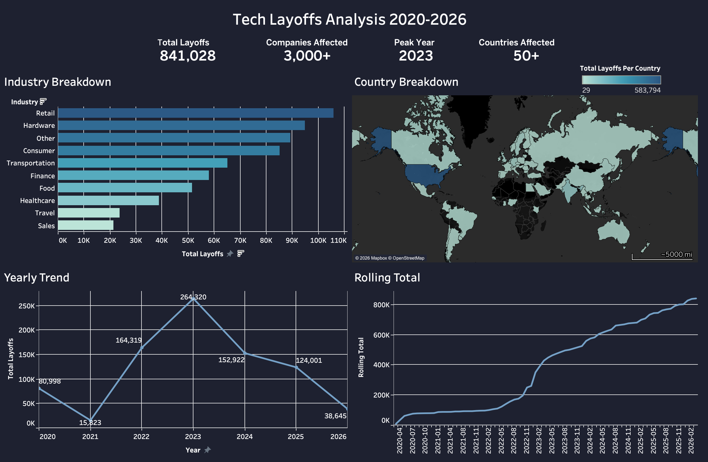

# Tech Layoffs Analysis 2020-2026

## Introduction
This project explores patterns in global 
tech company layoffs between 2020 and 2026, analyzing which industries were 
hit hardest, which countries were most affected, and how layoff trends evolved 
over time. This project covers data cleaning in MySQL and exploratory data 
analysis, with findings visualized in an interactive Tableau dashboard.

SQL queries: [project_sql folder](/project_sql/)

Interactive Dashboard: [Tableau Public](https://public.tableau.com/shared/PBRNZZN37?:display_count=n&:origin=viz_share_link)


### The questions I wanted to answer through my SQL queries were:
1. Which industries were hit hardest by layoffs?
2. Which countries had the most layoffs?
3. What years and months saw the most layoffs?
4. Are layoffs increasing or decreasing over time?


# Dataset
- **Source:** [Kaggle](https://www.kaggle.com/datasets/swaptr/layoffs-2022)
- **Collected by:** Roger Lee
- **Records:** 4,319 rows
- **Time Period:** March 2020 — March 2026


# Tools I Used
- **SQL**: The main tool in my analysis, allowing me to clean and query the 
  database to uncover key insights.
- **MySQL**: The database management system used to store and query the data.
- **Visual Studio Code**: Used for database management and executing SQL queries.
- **Tableau**: Used to build an interactive dashboard visualizing the findings.
- **Git & GitHub**: Essential for sharing my SQL scripts 
  and analysis.


# Part 1: Data Cleaning
Before any analysis could be done, the raw data needed to be cleaned.
Here's how I approached it:

### 1. Removed Duplicates
Created a staging table and used ROW_NUMBER() to identify and delete 
duplicate rows without affecting the original data.
```sql
CREATE TABLE `layoffs_staging2` (
  `company` text,
  `location` text,
  `total_laid_off` int DEFAULT NULL,
  `date` text,
  `percentage_laid_off` text,
  `industry` text,
  `stage` text,
  `funds_raised` int DEFAULT NULL,
  `country` text,
  `row_num` INT
) ENGINE=InnoDB DEFAULT CHARSET=utf8mb4 COLLATE=utf8mb4_0900_ai_ci;


INSERT INTO layoffs_staging2
SELECT *,
    ROW_NUMBER() OVER (PARTITION BY company, location, industry, total_laid_off, percentage_laid_off,`date`, stage, country, funds_raised) AS row_num
FROM layoffs_staging


DELETE 
FROM layoffs_staging2
WHERE row_num > 1;
```

### 2. Standardized Data
Trimmed whitespace, fixed inconsistent industry and country names, 
and converted the date column from TEXT to DATE format.
```sql
UPDATE layoffs_staging2 
SET company = TRIM(company);

UPDATE layoffs_staging2
SET `date` = STR_TO_DATE(`date`, '%m/%d/%Y');

ALTER TABLE layoffs_staging2
MODIFY COLUMN `date` DATE;
```

### 3. Handled Null Values
Converted empty strings to NULL where appropriate so they wouldn't 
interfere with aggregate functions during analysis.
```sql
DELETE 
FROM layoffs_staging2
WHERE percentage_laid_off IS NULL
AND total_laid_off IS NULL;
```

### 4. Removed Unnecessary Columns
Dropped the row_num column after cleaning was complete.
```sql
ALTER TABLE layoffs_staging2 
DROP COLUMN row_num;
```

# Part 2: Exploratory Data Analysis

### Overview
- **Total people laid off:** 841,028
- **Date range:** March 2020 — March 2026
- **Companies affected:** 3,000+
- **Countries represented:** 50+

### 1. Industries Hit Hardest
```sql
SELECT 
    industry,
    SUM(total_laid_off) AS total_layoffs,
    ROUND(SUM(total_laid_off) * 100.0 / 
    (SELECT SUM(total_laid_off) FROM layoffs_staging2), 2) AS percentage_of_total
FROM layoffs_staging2
WHERE industry IS NOT NULL
GROUP BY industry
ORDER BY total_layoffs DESC;
```

The top 5 industries accounted for over 52% of all layoffs combined.

| Industry       | Total Layoffs | % of Total |
|----------------|---------------|------------|
| Retail         |   105,976     | 12.60%     |
| Hardware       |    94,957     | 11.29%     |
| Other          |    89,284     | 10.62%     |
| Consumer       |    85,170     | 10.13%     |
| Transportation |    65,052     |  7.73%     |

**Key Insights:**
- Retail led with 12.60% of total layoffs driven by post-COVID as online shopping habits returned to pre-pandemic levels
- Hardware followed at 11.29% reflecting the sharp drop in demand 
  for home technology after the pandemic boom ended
- The top 5 industries alone account for over half of all global tech layoffs in this period

### 2. Countries With Most Layoffs
```sql
SELECT 
    country,
    SUM(total_laid_off) AS total_layoffs,
    ROUND(SUM(total_laid_off) * 100 / (SELECT SUM(total_laid_off) FROM layoffs_staging2), 2) AS percentage_of_total
FROM layoffs_staging2
WHERE country IS NOT NULL
GROUP BY country
ORDER BY total_layoffs DESC;
```

| Region         |  Total Layoffs     | % of Total Layoffs |
|----------------|--------------------|--------------------|  
| United States  | 583,794            | 69.41%             |
| India          | 65,384             | 7.77%              |
| Germany        | 31,488             | 3.74%              |
| United Kingdom | 22,277             | 2.65%              |
| Netherlands    | 21,575             | 2.57%              |


**Key Insights:**
- The United States accounted for nearly 70% of all layoffs globally
- India and Germany were the next most affected countries
- The US dominates due to its high concentration of tech companies,
  more flexible labor laws compared to Europe, and greater transparency 
  in reporting layoffs

### 3. Layoff Trends By Year
```sql
SELECT
    YEAR(`date`) AS year,
    COUNT(DISTINCT company) AS companies_affected,
    SUM(total_laid_off) AS total_layoffs,
    ROUND(AVG(total_laid_off), 0) AS avg_layoffs_per_compnay,
    ROUND(AVG(percentage_laid_off)* 100, 0) AS avg_percentage_laid_off
FROM layoffs_staging2
WHERE `date` IS NOT NULL
GROUP BY YEAR(`date`) 
ORDER BY year ASC;
```

| Year | Companies Affected | Total Layoffs | Avg Per Company |
|------|--------------------|---------------|-----------------|
| 2020 | 503                | 80,998        | 171             |
| 2021 | 34                 | 15,823        | 510             |
| 2022 | 913                | 164,319       | 201             |
| 2023 | 1,007              | 264,320       | 312             |
| 2024 | 473                | 152,922       | 394             |
| 2025 | 237                | 124,001       | 556             |
| 2026 | 51                 | 38,645        | 840             |

**Key Insights:**
- January and February consistently had the highest monthly layoffs 
  as companies restructure after closing annual books in December
- 2021 was unusually low with only 34 companies affected but an 
  average of 510 layoffs per company.
- 2023 was the worst year with 264,320 total layoffs across 1,007 companies
- The average layoffs per company is rising in 2025/2026 
  fewer companies are laying off but are layingoff at a higher count

### 4. Are Layoffs Increasing or Decreasing?
```sql
SELECT
    YEAR(`date`) AS year,
    SUM(total_laid_off) AS total_layoffs,
    LAG(SUM(total_laid_off)) OVER (ORDER BY YEAR(`date`)) AS previous_year,
    SUM(total_laid_off) - LAG(SUM(total_laid_off)) OVER (ORDER BY YEAR(`date`)) AS difference,
    ROUND((SUM(total_laid_off) - LAG(SUM(total_laid_off)) OVER (ORDER BY YEAR(`date`))) * 100 / 
    LAG(SUM(total_laid_off)) OVER (ORDER BY YEAR(`date`)), 2) AS percentage_change 
FROM layoffs_staging2
WHERE `date` IS NOT NULL
GROUP BY YEAR(`date`)
ORDER BY year ASC;
```

| Year | Total Layoffs | Previous Year| difference | Percentage Change|
|------|---------------|--------------|------------|------------------|
| 2020 | 80,998        | NULL         | NULL       | NULL             |
| 2021 | 15,823        | 80,998       | -65,175    | -80.46%          |
| 2022 | 164,319       | 15,823       | 148,496    | 938.48%          |
| 2023 | 264,320       | 164,319      | 100,00     | 60.86%           |
| 2024 | 152,922       | 264,320      | -111,398   | -42.15%          |
| 2025 | 124,001       | 124,001      | -28,921    | -18.91%          |
| 2026 | 38,645        | 38,645       | -85,356    | -68.83           |

**Key Insights:**
- 2021 layoffs were at their lowest as significant growth in technology stocks, driven by increased digitalization 
- 2022 saw a 938% increase from 2021 due to the over hiring during the pandemic
- The trend has been decreasing since 2024 suggesting the market 
  is stabilizing


# Dashboard
An interactive Tableau dashboard was built to visualize all findings.

[View the Interactive Dashboard Here](https://public.tableau.com/shared/PBRNZZN37?:display_count=n&:origin=viz_share_link)



# What I Learned
- **Window Functions:** Used ROW_NUMBER(), LAG(), and SUM() OVER() 
  to analyze trends and identify duplicates
- **CTEs:** Used Common Table Expressions to break complex queries 
  into readable and reusable steps
- **Data Cleaning:** Learned how to handle NULLs, duplicates, and 
  inconsistent formatting in real world messy data
- **Subqueries:** Used subqueries to calculate percentage of totals 
  across the entire dataset
- **CASE WHEN:** Used conditional logic to categorize and label 
  trends automatically
- **Tableau:** Built an interactive multi-chart dashboard combining 
  bar charts, maps, line charts and KPI metrics

# Conclusion

### Key Insights
1. **The US dominates global layoffs** accounting for nearly 70% 
   of all layoffs despite being one country
2. **2021 was the calmest year** with only 34 companies laid 
   off workers but 2022 saw a shocking 938% increase
3. **2023 was the worst year** with over 264,000 people laid off 
   across 1,007 companies
4. **The trend is improving** layoffs have been decreasing since 
   2024 but individual cuts are getting larger
5. **Retail and Hardware were hit hardest** accounting for nearly 
   24% of all layoffs combined

### Closing Thoughts
Working through this project strengthened my ability to work with real world messy data and turn it into clear actionable insights. The most valuable lesson was that good analysis is not just about writing correct queries it is also about asking the right questions and letting the data tell its story.